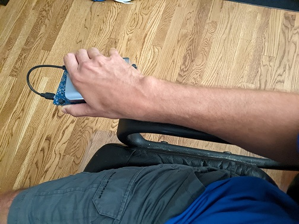
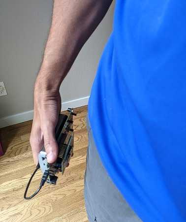
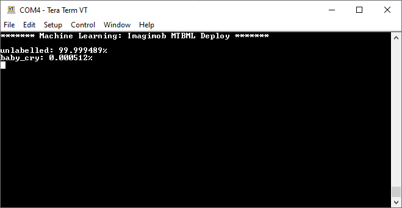
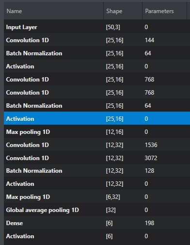
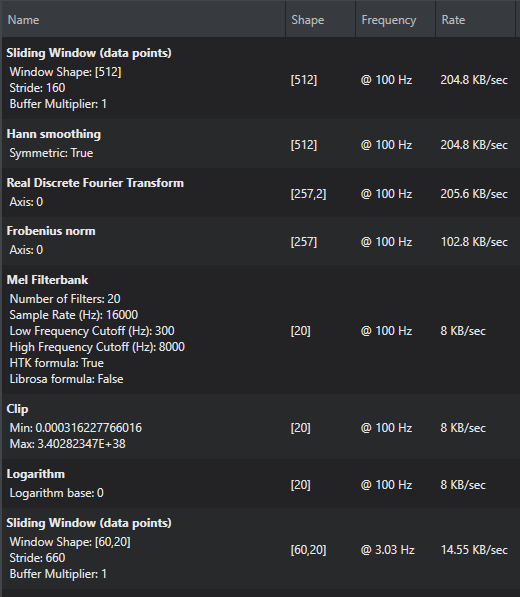

# Machine learning: Imagimob MTBML deployment

This code example demonstrates how to deploy an Imagimob-generated machine learning model with the ModusToolbox&trade; Machine Learning (MTBML) flow. The code example includes two models that are generated from Imagimob Studio's starter projects. The first model, human activity detect, uses data from an IMU which is then sent to the model to detect specific motions: sitting, standing, walking, running, or jumping. This model runs out-of-the-box. The second model, baby crying detection, uses data from the pulse-density modulation to pulse-code modulation (PDM/PCM) which is sent to the model to detect whether a baby is crying or not.

Both models require pre-processing produced by Imagimob Studios. Human activity detect uses imu_model.c/h and baby crying detect uses pdm_model.c/.h. New models based on IMU or PDM/PCM data can be dropped into this example as-is. To collect data using the [Imagimob's Capture Server](https://bitbucket.org/imagimob/captureserver/src/master/), see the [Imagimob data collection](https://github.com/Infineon/mtb-example-ml-imagimob-data-collection) code example.

This example requires the use of ModusToolbox&trade; Machine Learning Configurator to generate sources for the Imagimob models.

This example supports models from Imagimob Studio, visit [Imagimob](https://developer.imagimob.com/) for more information and to get the Imagimob Studio download.

[View this README on GitHub.](https://github.com/Infineon/mtb-example-ml-imagimob-mtbml-deploy)

[Provide feedback on this code example.](https://cypress.co1.qualtrics.com/jfe/form/SV_1NTns53sK2yiljn?Q_EED=eyJVbmlxdWUgRG9jIElkIjoiQ0UyMjM1NDEiLCJTcGVjIE51bWJlciI6IjAwMi0yMzU0MSIsIkRvYyBUaXRsZSI6IkhBTDogSGVsbG8gd29ybGQiLCJyaWQiOiJraGF0cmluYXZpbmsiLCJEb2MgdmVyc2lvbiI6IjQuNC4wIiwiRG9jIExhbmd1YWdlIjoiRW5nbGlzaCIsIkRvYyBEaXZpc2lvbiI6Ik1DRCIsIkRvYyBCVSI6IklDVyIsIkRvYyBGYW1pbHkiOiJQU09DIn0=)

## Requirements


- [ModusToolbox&trade;](https://www.infineon.com/modustoolbox) v3.1 or later (tested with v3.1)
- [ModusToolbox&trade; Machine Learning Pack v2.0](https://softwaretools.infineon.com/tools/com.ifx.tb.tool.modustoolboxpackmachinelearning) or later (tested with v2.0)
- Programming language: C
- Associated parts: [PSoC&trade; 62S2 Wi-Fi Bluetooth&reg; Pioneer Kit](https://www.infineon.com/CY8CKIT-062S2-43012) (`CY8CKIT-062S2-43012`) + [IoT Sense Expansion Kit](https://www.infineon.com/cms/en/product/evaluation-boards/cy8ckit-028-sense) 
- PSoC&trade; 6 board support package (BSP) minimum required version: 4.0.0


## Supported toolchains (make variable 'TOOLCHAIN')

- GNU Arm&reg; Embedded Compiler v10.3.1 (`GCC_ARM`) - Default value of `TOOLCHAIN`
- Arm&reg; Compiler v6.16 (`ARM`)

> **Note:** This code example requires the use of TensorFlow Lite for Microcontrollers (TFLM) for inferencing which is not supported with IAR Embedded Workbench.


## Supported kits (make variable 'TARGET')

- [PSoC&trade; 62S2 Wi-Fi Bluetooth&reg; Pioneer Kit](https://www.infineon.com/CY8CKIT-062S2-43012) (`CY8CKIT-062S2-43012`) – Default value of `TARGET`

A shield is also required to run this code example. The following shields are supported:
- [IoT Sense Expansion Kit](https://www.infineon.com/cms/en/product/evaluation-boards/cy8ckit-028-sense) (`CY8CKIT-028-SENSE`)
- [TFT Display Shield Board](https://www.infineon.com/cms/en/product/evaluation-boards/cy8ckit-028-tft) (`CY8CKIT-028-TFT`)
- [CY8CKIT-028-EPD](https://www.infineon.com/cms/en/product/evaluation-boards/cy8ckit-028-epd) (`CY8CKIT-028-TFT`)

## Hardware setup

Connect the CY8CKIT-028-SENSE shield to the baseboard header compatible with Arduino.

The code example also works with the CY8CKIT-028-TFT and CY8CKIT-028-EPD shields. See the [Operation](#operation) section for more information.

## Software setup

See the [ModusToolbox&trade; tools package installation guide](https://www.infineon.com/ModusToolboxInstallguide) for information about installing and configuring the tools package.

Install the [Machine Learning pack](https://softwaretools.infineon.com/tools/com.ifx.tb.tool.modustoolboxpackmachinelearning).

Install a terminal emulator if you don't have one. Instructions in this document use [Tera Term](https://ttssh2.osdn.jp/index.html.en).

Use the ModusToolbox&trade;-ML Configurator tool (from *{ModusToolbox&trade; install directory}/packs/ModusToolbox-Machine-Learning-Pack/tools/ml-configurator/*) to load a pre-trained neural net (NN) model and generate C files to be used with this code example. Alternatively, you can launch the configurator tool in Eclipse IDE for ModusToolbox&trade; from the Quick Launch window. For more information, see the [ModusToolbox&trade; Machine Learning user guide](https://www.infineon.com/ModusToolboxMLUserGuide).

By default, the makefile uses a model that comes with the code example. The pre-trained neural net (NN) models are located in the *Edge/IMU* and *Edge/PDM* folders. By default the code example uses the model in *Edge/IMU*. The project name is set to *imagimob_model*. You can use the ModusToolbox&trade;-ML Configurator tool to open the *design.mtbml* model to evaluate the models.

The project name is set to *IMAGIMOB_MODEL*. If you change any of these default settings, edit the following Makefile parameters of this code example:

Makefile parameter    | Description
 ---------------------| ---------------
`NN_MODEL_NAME=`      | Defines the name of the model. The name comes from the *project name* defined in the ML Configurator tool. No quotes are used when changing the name of the model.
`NN_MODEL_FOLDER=`    | Sets the name where the model files will be placed. The name comes from the *output file location* defined in the ModusToolbox&trade;-ML Configurator tool.
`NN_INFERENCE_ENGINE` | Defines the inference engine to run. It has three options: `tflm` or `tflm_less`.

For information on available inference engines, see the [ModusToolbox&trade; Machine Learning user guide](https://www.infineon.com/ModusToolboxMLUserGuide).

<br>

## Using the code example

### Create the project

The ModusToolbox&trade; tools package provides the Project Creator as both a GUI tool and a command line tool.

<details><summary><b>Use Project Creator GUI</b></summary>

1. Open the Project Creator GUI tool.

   There are several ways to do this, including launching it from the dashboard or from inside the Eclipse IDE. For more details, see the [Project Creator user guide](https://www.infineon.com/ModusToolboxProjectCreator) (locally available at *{ModusToolbox&trade; install directory}/tools_{version}/project-creator/docs/project-creator.pdf*).

2. On the **Choose Board Support Package (BSP)** page, select a kit supported by this code example. See [Supported kits](#supported-kits-make-variable-target).

   > **Note:** To use this code example for a kit not listed here, you may need to update the source files. If the kit does not have the required resources, the application may not work.

3. On the **Select Application** page:

   a. Select the **Applications(s) Root Path** and the **Target IDE**.

   > **Note:** Depending on how you open the Project Creator tool, these fields may be pre-selected for you.

   b.	Select this code example from the list by enabling its check box.

   > **Note:** You can narrow the list of displayed examples by typing in the filter box.

   c. (Optional) Change the suggested **New Application Name** and **New BSP Name**.

   d. Click **Create** to complete the application creation process.

</details>

<details><summary><b>Use Project Creator CLI</b></summary>

The 'project-creator-cli' tool can be used to create applications from a CLI terminal or from within batch files or shell scripts. This tool is available in the *{ModusToolbox&trade; install directory}/tools_{version}/project-creator/* directory.

Use a CLI terminal to invoke the 'project-creator-cli' tool. On Windows, use the command-line 'modus-shell' program provided in the ModusToolbox&trade; installation instead of a standard Windows command-line application. This shell provides access to all ModusToolbox&trade; tools. You can access it by typing "modus-shell" in the search box in the Windows menu. In Linux and macOS, you can use any terminal application.

The following example clones the "[mtb-example-ml-imagimob-mtbml-deploy](https://github.com/Infineon/mtb-example-ml-imagimob-mtbml-deploy)" application with the desired name "ImagimobMTBMLDeploy" configured for the *CY8CKIT-062S2-43012* BSP into the specified working directory, *C:/mtb_projects*:

   ```
   project-creator-cli --board-id CY8CKIT-062S2-43012 --app-id mtb-example-ml-imagimob-mtbml-deploy --user-app-name ImagimobMTBMLDeploy --target-dir "C:/mtb_projects"
   ```


The 'project-creator-cli' tool has the following arguments:

Argument | Description | Required/optional
---------|-------------|-----------
`--board-id` | Defined in the <id> field of the [BSP](https://github.com/Infineon?q=bsp-manifest&type=&language=&sort=) manifest | Required
`--app-id`   | Defined in the <id> field of the [CE](https://github.com/Infineon?q=ce-manifest&type=&language=&sort=) manifest | Required
`--target-dir`| Specify the directory in which the application is to be created if you prefer not to use the default current working directory | Optional
`--user-app-name`| Specify the name of the application if you prefer to have a name other than the example's default name | Optional

> **Note:** The project-creator-cli tool uses the `git clone` and `make getlibs` commands to fetch the repository and import the required libraries. For details, see the "Project creator tools" section of the [ModusToolbox&trade; tools package user guide](https://www.infineon.com/ModusToolboxUserGuide) (locally available at {ModusToolbox&trade; install directory}/docs_{version}/mtb_user_guide.pdf).

</details>


### Open the project

After the project has been created, you can open it in your preferred development environment.


<details><summary><b>Eclipse IDE</b></summary>

If you opened the Project Creator tool from the included Eclipse IDE, the project will open in Eclipse automatically.

For more details, see the [Eclipse IDE for ModusToolbox&trade; user guide](https://www.infineon.com/MTBEclipseIDEUserGuide) (locally available at *{ModusToolbox&trade; install directory}/docs_{version}/mt_ide_user_guide.pdf*).

</details>


<details><summary><b>Visual Studio (VS) Code</b></summary>

Launch VS Code manually, and then open the generated *{project-name}.code-workspace* file located in the project directory.

For more details, see the [Visual Studio Code for ModusToolbox&trade; user guide](https://www.infineon.com/MTBVSCodeUserGuide) (locally available at *{ModusToolbox&trade; install directory}/docs_{version}/mt_vscode_user_guide.pdf*).

</details>


<details><summary><b>Keil µVision</b></summary>

Double-click the generated *{project-name}.cprj* file to launch the Keil µVision IDE.

For more details, see the [Keil µVision for ModusToolbox&trade; user guide](https://www.infineon.com/MTBuVisionUserGuide) (locally available at *{ModusToolbox&trade; install directory}/docs_{version}/mt_uvision_user_guide.pdf*).


</details>


<details><summary><b>Command line</b></summary>

If you prefer to use the CLI, open the appropriate terminal, and navigate to the project directory. On Windows, use the command-line 'modus-shell' program; on Linux and macOS, you can use any terminal application. From there, you can run various `make` commands.

For more details, see the [ModusToolbox&trade; tools package user guide](https://www.infineon.com/ModusToolboxUserGuide) (locally available at *{ModusToolbox&trade; install directory}/docs_{version}/mtb_user_guide.pdf*).

</details>


## Operation

1. Connect the board to your PC using the provided USB cable through the KitProg3 USB connector. The example is set up to use the CY8CKIT-028-SENSE shield.
   If using the CY8CKIT-028-TFT shield, change `SHIELD_DATA_COLLECTION=TFT_SHIELD` in the Makefile.
   If using the CY8CKIT-028-EPD shield, change `SHIELD_DATA_COLLECTION=EPD_SHIELD` in the Makefile.

   To check the version of CY8CKIT-028-SENSE, locate the sticker on the bottom of the shield's box which indicates the revision.

   - If the shield is Rev "**", use `SHIELD_DATA_COLLECTION=SENSE_SHIELD`.
   - If the shield is Rev "*A", use `SHIELD_DATA_COLLECTION=SENSE_SHIELD_v2`.

2. Open a terminal program and select the KitProg3 COM port. Set the serial port parameters to 8N1 and 115200 baud.

3. Program the board using one of the following:

   <details><summary><b>Using Eclipse IDE</b></summary>

      1. Select the application project in the Project Explorer.

      2. In the **Quick Panel**, scroll down, and click **\<Application Name> Program (KitProg3_MiniProg4)**.
   </details>


   <details><summary><b>In other IDEs</b></summary>

   Follow the instructions in your preferred IDE.
   </details>


   <details><summary><b>Using CLI</b></summary>

     From the terminal, execute the `make program` command to build and program the application using the default toolchain to the default target. The default toolchain is specified in the application's Makefile but you can override this value manually:
      ```
      make program TOOLCHAIN=<toolchain>
      ```

      Example:
      ```
      make program TOOLCHAIN=GCC_ARM
      ```
   </details>

4. After programming, the application starts automatically. Confirm that "Machine Learning: Imagimob MTBML Deploy" is displayed on the UART terminal.


   **Figure 1. Terminal output IMU**

   

5. While holding the kit board in your hand, perform various activities (sitting, standing, walking, running, jumping) and observe that the model detects and reports the correct activity. For proper detection, the sensor on the board must be oriented in the same general manner in which it is trained. The orientation for sitting and standing are shown in Figure 2 and Figure 3 respectively. For walking, running, and jumping the board is held the same orientation as standing with the normal arm movements associated with the respective activity.

   **Figure 2. Sitting: KitProg USB facing forward, shield toward the ground**

   

   **Figure 3. Standing: KitProg USB facing forward, shield toward the body**

    

6. The code example includes a Baby Crying detection model that utilizes the PDM/PCM and is located in the *Edge/PDM* folder. To run the model, open the Machine Learning Configurator in Eclipse or run "make ml-configurator" in the command console. When the configurator comes up, set the **Pretrained model** to "Edge/PDM/baby_cry.h5" and select "Generate Source". 

   **Figure 4. ModusToolbox&trade; ML configurator**

    

7. To configure the application to run the Baby Crying detection model, open the *source/config.h* and set `INFERENCE_MODE_SELECT = PDM_INFERENCE`.

8. Program the device as outlined in Step 3.

9. After programming, the application starts automatically. Confirm that "Machine Learning: Imagimob MTBML Deploy" displays on the UART terminal.

   **Figure 5. Terminal output PDM**

   

10. Make baby crying sounds and observe that the model detects and reports the correct classification.

11. The models and preprocessing can be updated to use other models generated by the Imagimob Studio. If updating the models and preprocessing, ensure that the preprocessing files are named imu_model.h for IMU-based projects and pdm_model.c for PDM/PCM-based projects. For more information on the Human Activity and Baby Crying projects, see [Imagimob Starter Projects](https://developer.imagimob.com/getting-started/starter-project).

12. To switch the model back to Human Activity detection, open the Machine Learning Configurator and set the **Pretrained Model** to "Edge/PDM/human_activity.h5" and select "Generate Source*. Then to configure the application to run the Human Activity model open *source/config.h* and set `INFERENCE_MODE_SELECT = IMU_INFERENCE` and program the device.

## Debugging


You can debug the example to step through the code.


<details><summary><b>In Eclipse IDE</b></summary>

Use the **\<Application Name> Debug (KitProg3_MiniProg4)** configuration in the **Quick Panel**. For details, see the "Program and debug" section in the [Eclipse IDE for ModusToolbox&trade; user guide](https://www.infineon.com/MTBEclipseIDEUserGuide).

> **Note:** **(Only while debugging)** On the CM4 CPU, some code in `main()` may execute before the debugger halts at the beginning of `main()`. This means that some code executes twice – once before the debugger stops execution, and again after the debugger resets the program counter to the beginning of `main()`. See [KBA231071](https://community.infineon.com/docs/DOC-21143) to learn about this and for the workaround.

</details>


<details><summary><b>In other IDEs</b></summary>

Follow the instructions in your preferred IDE.
</details>


## Design and implementation

The example includes two different models that can be run. The first is the Human Activity model that works out-of-the-box and the second is the Baby Crying model that can be configured to run. The project is designed to run one model at a time.

### Human Activity detection

The Human Activity detection model takes data from a motion sensor (BMX160 or BMI160). This example uses a combination of Imagimob's standard flow and the MTBML flow. Imagimob Studio provides the .h5 file which is input into the MTBML configurator to generate the source for the embedded device. Imagimob also produces the imu_model.c/h which contains the processing required before the data is fed to the model.

The data consists of the 3-axis accelerometer data obtained from the motion sensor. A timer is configured to interrupt at 50 Hz to sample the motion sensor. The interrupt handler reads all data from the sensor via I2C or SPI and feeds it to the Imagimob pre-processor through the IMAI_IMU_enqueue function. After the pre-processor has enough data captured, the IMAI_IMU_dequeue returns a 50 by 3 buffer stored with the pre-processed data. This data is passed to the Human Activity model through the MTBML middleware to determine the activity that is occurring. Each possible activity is assigned a confidence score. The confidence score output from the inference engine is printed to the UART terminal for review.

The pre-processor uses a 50-frame sliding window for evaluating data over a period of 1 second. The model is a standard convolutional neural network (CNN) model consisting of five convolutional groups. These groups are divided into three groups of convolutional blocks (one or two layers), a batch normalization layer, a rectified linear unit (ReLU) activation layer, and a max pooling layer.

   **Figure 6. Human Activity Model layers**

   

The convolutional layers act as feature extractors and provide abstract representations of the input sensor data in feature maps. They capture short-term dependencies (spatial relationships) of the data. In the CNN, features are extracted and then used as inputs to later feature extractors, finally a softmax activation is used for final classification.

### Baby Cry detection

The Baby Crying model gathers pulse-density modulation to pulse-code modulation (PDM/PCM) audio data to classify whether a baby is crying. Imagimob Studio provides the .h5 file which is input into the MTBML configurator to generate source for the embedded device. Imagimob also produces the pdm_model.c/h which contains the processing required before the data is fed to the model.

The data consists of PDM/PCM data. The PDM/PCM is sampled at 16 kHz and an interrupt is generated after 1024 samples are collected. After 1024 samples are collected, the data is fed to the Imagimob pre-processor through the IMAI_PDM_enqueue function. After the pre-processor has enough data captured, IMAI_IMU_dequeue returns a 60 by 20 buffer stored with the pre-processed data. This data is then passed to the Baby Crying model through the MTBML middleware to determine if a baby is crying or not. The confidence that a baby is crying is produced by the inference engine and is printed on the UART terminal for review.

   **Figure 7. Baby Cry pre-processing layers**

   

The Baby Crying detect model is a 2D convolutional neural net that contains the layers as shown in the following figure.

   **Figure 8. Baby Cry model layers**

   

### Model generation

This code example ships with the Human Activity (human_activity.h5, imu_model.c/h) and the Baby Cry files (baby_cry.h5, pdm_model.c/h) produced by the Imagimob Studio. Imagimob Studio can be used to capture the new data as well as review, modify, or generate the new models for evaluation. To use a new model, ensure that the names match when on the "Edge" tab of Imagimob Studio before selecting the "build edge".

Build edge parameters | IMU | PDM
----------------------|-----|-----------
`Output Name`         | imu_model | pdm_model
`C Prefix`            | IMAI_IMU_ | IMAI_PDM_
`Build`               | Preprocessor | Preprocessor

<br>

   **Figure 9. IMU build edge parameters example**

   

The generated .h5 file and the xxx_model.c/h files can then be copied into *Edge/IMU* or *Edge/PDM* depending on the selected sensor. To run the new model, open the Machine Learning Configurator, set the **Pretrained model** to the newly trained model, and select "Generate Source*. Then configure the application for the desired sensor by opening *source/config.h* and setting `INFERENCE_MODE_SELECT = PDM_INFERENCE` or `INFERENCE_MODE_SELECT = IMU_INFERENCE`.

### Files and folders

```
|-- mtb_ml_gen/            # Contains the model files
|-- Edge/                  # Contains all the model files produced by Imagimob
   |- IMU                  # Contains the IMU preprocessing and .h5 model
   |- PDM                  # Contains the PDM preprocessing and .h5 model
|-- source                 # Contains the source code files for this example
   |- audio.c/h            # Implements the PDM to collect data
   |- imu.c/h              # Implements the IMU to collect data
   |- inference.c/h        # Implements the inferencing and outputs to the terminal
   |- config.h             # Configures the application for either PDM or IMU model
|-- design.mtbml           # ModusToolbox&trade;-ML Configurator tool project file
```

<br>


### Resources and settings

**Table 1. Application resources**

 Resource  |  Alias/object     |    Purpose
 :-------- | :-------------    | :------------
 UART (HAL)|cy_retarget_io_uart_obj| UART HAL object used by Retarget-IO for the Debug UART port
 Timer    | imu_timer     | Timer HAL object used to periodically read from the IMU
 I2C (HAL) | i2c | I2C HAL object used to communicate with the IMU sensor (used for the CY8CKIT-028-TFT shield)
 SPI (HAL) | spi | SPI HAL object used to communicate with the IMU sensor (used for the CY8CKIT-028-SENSE shield)
 PDM_PCM | pdm_pcm | PDM HAL object used to interact with the shields PDM sensors

<br>


## Related resources


Resources  | Links
-----------|----------------------------------
Application notes  | [AN228571](https://www.infineon.com/AN228571) – Getting started with PSoC&trade; 6 MCU on ModusToolbox&trade; <br>  [AN215656](https://www.infineon.com/AN215656) – PSoC&trade; 6 MCU: Dual-CPU system design
Code examples  | [Using ModusToolbox&trade;](https://github.com/Infineon/Code-Examples-for-ModusToolbox-Software) on GitHub
Device documentation | [PSoC&trade; 6 MCU datasheets](https://documentation.infineon.com/html/psoc6/bnm1651211483724.html) <br> [PSoC&trade; 6 technical reference manuals](https://documentation.infineon.com/html/psoc6/zrs1651212645947.html)
Development kits | Select your kits from the [Evaluation board finder](https://www.infineon.com/cms/en/design-support/finder-selection-tools/product-finder/evaluation-board).
Libraries on GitHub  | [mtb-pdl-cat1](https://github.com/Infineon/mtb-pdl-cat1) – PSoC&trade; 6 Peripheral Driver Library (PDL)  <br> [mtb-hal-cat1](https://github.com/Infineon/mtb-hal-cat1) – Hardware Abstraction Layer (HAL) library <br> [retarget-io](https://github.com/Infineon/retarget-io) – Utility library to retarget STDIO messages to a UART port
Middleware on GitHub  | [psoc6-middleware](https://github.com/Infineon/modustoolbox-software#psoc-6-middleware-libraries) – Links to all PSoC&trade; 6 MCU middleware
Tools  | [ModusToolbox&trade;](https://www.infineon.com/modustoolbox) – ModusToolbox&trade; software is a collection of easy-to-use libraries and tools enabling rapid development with Infineon MCUs for applications ranging from wireless and cloud-connected systems, edge AI/ML, embedded sense and control, to wired USB connectivity using PSoC&trade; Industrial/IoT MCUs, AIROC&trade; Wi-Fi and Bluetooth&reg; connectivity devices, XMC&trade; Industrial MCUs, and EZ-USB&trade;/EZ-PD&trade; wired connectivity controllers. ModusToolbox&trade; incorporates a comprehensive set of BSPs, HAL, libraries, configuration tools, and provides support for industry-standard IDEs to fast-track your embedded application development.

<br>

## Other resources


Infineon provides a wealth of data at [www.infineon.com](https://www.infineon.com) to help you select the right device, and quickly and effectively integrate it into your design.


## Document history


Document title: *CE238471* - *Machine learning: Imagimob MTBML deployment*

 Version | Description of change
 ------- | ---------------------
 1.0.0   | New code example
<br>


All referenced product or service names and trademarks are the property of their respective owners.

The Bluetooth&reg; word mark and logos are registered trademarks owned by Bluetooth SIG, Inc., and any use of such marks by Infineon is under license.


---------------------------------------------------------

© Cypress Semiconductor Corporation, 2023. This document is the property of Cypress Semiconductor Corporation, an Infineon Technologies company, and its affiliates ("Cypress").  This document, including any software or firmware included or referenced in this document ("Software"), is owned by Cypress under the intellectual property laws and treaties of the United States and other countries worldwide.  Cypress reserves all rights under such laws and treaties and does not, except as specifically stated in this paragraph, grant any license under its patents, copyrights, trademarks, or other intellectual property rights.  If the Software is not accompanied by a license agreement and you do not otherwise have a written agreement with Cypress governing the use of the Software, then Cypress hereby grants you a personal, non-exclusive, nontransferable license (without the right to sublicense) (1) under its copyright rights in the Software (a) for Software provided in source code form, to modify and reproduce the Software solely for use with Cypress hardware products, only internally within your organization, and (b) to distribute the Software in binary code form externally to end users (either directly or indirectly through resellers and distributors), solely for use on Cypress hardware product units, and (2) under those claims of Cypress's patents that are infringed by the Software (as provided by Cypress, unmodified) to make, use, distribute, and import the Software solely for use with Cypress hardware products.  Any other use, reproduction, modification, translation, or compilation of the Software is prohibited.
<br>
TO THE EXTENT PERMITTED BY APPLICABLE LAW, CYPRESS MAKES NO WARRANTY OF ANY KIND, EXPRESS OR IMPLIED, WITH REGARD TO THIS DOCUMENT OR ANY SOFTWARE OR ACCOMPANYING HARDWARE, INCLUDING, BUT NOT LIMITED TO, THE IMPLIED WARRANTIES OF MERCHANTABILITY AND FITNESS FOR A PARTICULAR PURPOSE.  No computing device can be absolutely secure.  Therefore, despite security measures implemented in Cypress hardware or software products, Cypress shall have no liability arising out of any security breach, such as unauthorized access to or use of a Cypress product. CYPRESS DOES NOT REPRESENT, WARRANT, OR GUARANTEE THAT CYPRESS PRODUCTS, OR SYSTEMS CREATED USING CYPRESS PRODUCTS, WILL BE FREE FROM CORRUPTION, ATTACK, VIRUSES, INTERFERENCE, HACKING, DATA LOSS OR THEFT, OR OTHER SECURITY INTRUSION (collectively, "Security Breach").  Cypress disclaims any liability relating to any Security Breach, and you shall and hereby do release Cypress from any claim, damage, or other liability arising from any Security Breach.  In addition, the products described in these materials may contain design defects or errors known as errata which may cause the product to deviate from published specifications. To the extent permitted by applicable law, Cypress reserves the right to make changes to this document without further notice. Cypress does not assume any liability arising out of the application or use of any product or circuit described in this document. Any information provided in this document, including any sample design information or programming code, is provided only for reference purposes.  It is the responsibility of the user of this document to properly design, program, and test the functionality and safety of any application made of this information and any resulting product.  "High-Risk Device" means any device or system whose failure could cause personal injury, death, or property damage.  Examples of High-Risk Devices are weapons, nuclear installations, surgical implants, and other medical devices.  "Critical Component" means any component of a High-Risk Device whose failure to perform can be reasonably expected to cause, directly or indirectly, the failure of the High-Risk Device, or to affect its safety or effectiveness.  Cypress is not liable, in whole or in part, and you shall and hereby do release Cypress from any claim, damage, or other liability arising from any use of a Cypress product as a Critical Component in a High-Risk Device. You shall indemnify and hold Cypress, including its affiliates, and its directors, officers, employees, agents, distributors, and assigns harmless from and against all claims, costs, damages, and expenses, arising out of any claim, including claims for product liability, personal injury or death, or property damage arising from any use of a Cypress product as a Critical Component in a High-Risk Device. Cypress products are not intended or authorized for use as a Critical Component in any High-Risk Device except to the limited extent that (i) Cypress's published data sheet for the product explicitly states Cypress has qualified the product for use in a specific High-Risk Device, or (ii) Cypress has given you advance written authorization to use the product as a Critical Component in the specific High-Risk Device and you have signed a separate indemnification agreement.
<br>
Cypress, the Cypress logo, and combinations thereof, ModusToolbox, PSoC, CAPSENSE, EZ-USB, F-RAM, and TRAVEO are trademarks or registered trademarks of Cypress or a subsidiary of Cypress in the United States or in other countries. For a more complete list of Cypress trademarks, visit www.infineon.com. Other names and brands may be claimed as property of their respective owners.
